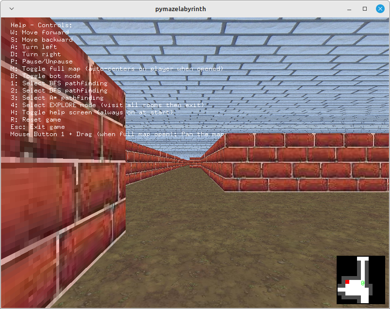

# pymazelabyrinth
3D Maze
W.I.P. Fully playable demo. 
Tested on Python 3.10.12 (main, Feb  4 2025, 14:57:36) [GCC 11.4.0] on linux

# 🧱 Brick Labyrinth

A 3D first-person maze exploration game built with **Python**, **OpenGL**, and **GLFW**. Explore procedurally generated mazes, navigate through rooms and corridors, or let the AI bot find the way out using pathfinding algorithms!

## Screenshots

### Game

## 🌀 Influence: Windows 3D Maze Screensaver

This game draws inspiration from the nostalgic **Windows 95 3D Maze Screensaver**, bringing its iconic style into an interactive form:

- **First-person maze navigation** – just like the screensaver, you explore the maze from a first-person view.
- **Grid-based movement and 90° turns** – the maze layout mimics the classic tile-based structure.
- **Simple 3D visuals** – with textured walls, ceilings, and floors that echo the retro aesthetic.
- **Powered by OpenGL** – like the original screensaver, this game uses **OpenGL** for rendering the 3D environment.

This screensaver served as a creative foundation, now reimagined as a playable, procedurally generated game with added features like minimaps and AI navigation.

---

## 🎮 Features

- 🧭 **Procedural Maze Generation**
  - Generates random dungeons with rooms, corridors, and exits
  - Inspired by NetHack-style maps

- 👁️ **3D First-Person View**
  - Navigate the maze with keyboard controls
  - Smooth movement and turning animations
  - Textured floors, walls, ceilings

- 🗺️ **Map Overlays**
  - **Minimap** showing nearby discovered cells
  - **Full map** view with mouse panning
  - **Fog of war** effect: only discovered areas are visible

- 🤖 **AI Bot Mode**
  - Toggleable bot to auto-navigate the maze
  - Supports multiple pathfinding algorithms:
    - BFS (Breadth-First Search)
    - DFS (Depth-First Search)
    - A* (A-star)
    - EXPLORE (visit all rooms, then exit)

---

## 🕹️ Controls

| Key | Action |
|-----|--------|
| `W` | Move forward |
| `S` | Move backward |
| `A` | Turn left |
| `D` | Turn right |
| `P` | Pause/Unpause game |
| `M` | Toggle full map view |
| `H` | Toggle help overlay |
| `B` | Toggle bot mode |
| `1` | Select BFS algorithm |
| `2` | Select DFS algorithm |
| `3` | Select A* algorithm |
| `4` | Select EXPLORE mode |
| `R` | Reset maze |
| `Esc` | Exit game |
| `Mouse + Drag` | Pan the full map view |

---

## 🚀 Getting Started

### 📦 Requirements

- Python 3.x
- GLFW
- PyOpenGL
- NumPy
- PIL (Pillow)
- `nethack_map_generator.py` and `bot_pathfinding.py` (included or to be added)

## 🧩 Module Overview

Here's a quick explanation of all the modules and libraries used in this project:

| Import | Description |
|--------|-------------|
| `random` | Standard Python module for generating random numbers. |
| `nethack_map_generator` | Custom module for generating NetHack-style dungeon maps. Make sure this file is in the same directory. |
| `bot_pathfinding` | Custom pathfinding logic for bots navigating the map. |
| `glfw` | Library for creating windows and handling input in OpenGL contexts. |
| `OpenGL.GL` | Core OpenGL functions for rendering. |
| `OpenGL.GLU` | OpenGL Utility Library for projections and camera transformations. |
| `OpenGL.GLUT` | OpenGL Utility Toolkit for windowing and utility functions (often used for prototyping). |
| `numpy` | Powerful numerical operations and array handling. |
| `glm` | OpenGL Mathematics library (Python port), used for vectors, matrices, and transformations. |
| `PIL.Image` | Part of Pillow, used for image loading and texture handling. |
| `math` | Standard mathematical functions like sin, cos, and sqrt. |
| `ctypes` | Interfacing with C-style data types, useful when passing data to OpenGL. |
| `sys` | Access to system-specific parameters and functions (e.g., command-line args). |
| `time` | Time measurement utilities, often used for frame timing. |
| `collections.deque` | Double-ended queue for fast FIFO/LIFO operations, useful in pathfinding or input buffering. |

## 🤖 AI Assistance Disclaimer

This game was created with the assistance of AI tools (e.g., ChatGPT) for various tasks such as:

- Code suggestions and debugging  
- Design ideas and architectural guidance  
- Problem-solving and refactoring help  
- Occasional motivational pep talks

While AI provided helpful input during development, all decisions, edits, and final implementations were made by a human (yes, really).  
Think of it as pair programming… with a very talkative robot.

Used textures:
https://opengameart.org/content/tileable-dirt-textures
https://opengameart.org/content/bricks-tiled-texture-64x64
https://opengameart.org/content/50-free-textures-5-with-normalmaps?page=2
https://opengameart.org/content/exit-sign-64
